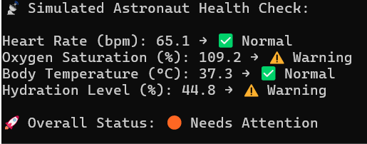

# 🛰 Space Health Tracker – Simulated Monitoring for Astronauts

This project simulates a basic health monitoring system for astronauts during space missions. It uses Python to generate and display vital signs like heart rate, oxygen saturation, and body temperature in real time. The simulation is designed as an exploratory tool to understand how biomedical tracking might work in microgravity environments.

---

## 💡 Project Motivation

As a Biomedical Engineering student passionate about space technology, I was intrigued by the intersection of health and space. Astronauts in orbit face unique physiological changes, and monitoring their health is crucial for mission success. This Python-based console tracker is a small step toward simulating that need.

---

## 🧠 Features

- Simulated readings for:
  - Heart Rate (bpm)
  - Oxygen Saturation (%SpO₂)
  - Body Temperature (°C)
- Randomized but realistic values
- Continuous loop with clear formatting
- Can be extended with alert systems or data logging

---

## 📸 Sample Output

Here’s a preview of the simulated output:

---

## 🛠 How to Run

1. Make sure Python is installed.
2. Clone or download the repository.
3. Navigate to the folder in command prompt or terminal.

   
